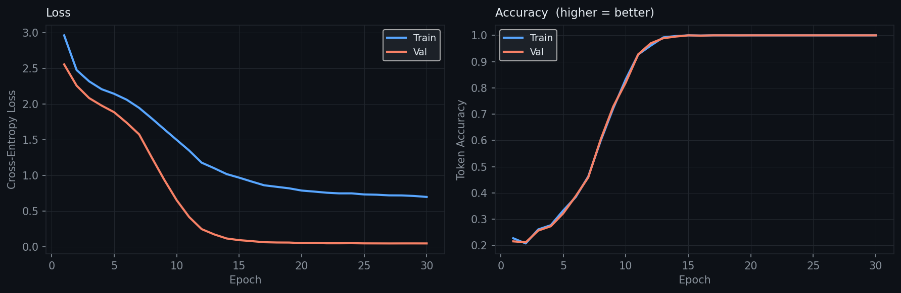
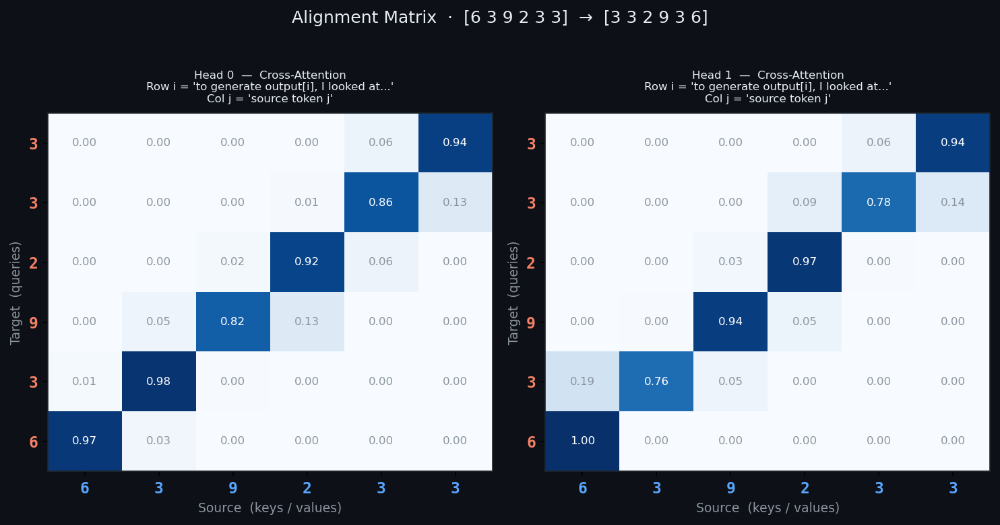
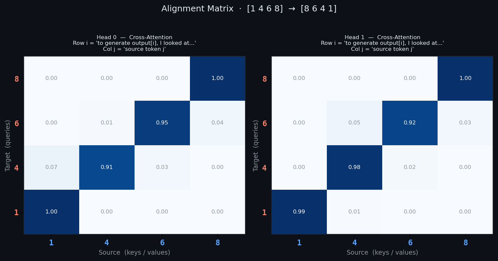
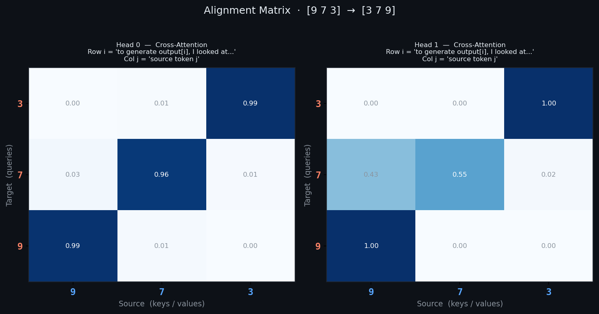

# Theory & Code Walkthrough — mini-cross-attention

> Step 6 of the mini-LLM series. Prerequisite: [mini-transformer](../mini-transformer).

---

## Table of Contents

1. [What this step adds](#1-what-this-step-adds)
2. [The problem self-attention cannot solve](#2-the-problem-self-attention-cannot-solve)
3. [Cross-attention — the math](#3-cross-attention--the-math)
4. [The alignment matrix](#4-the-alignment-matrix)
5. [The encoder-decoder architecture](#5-the-encoder-decoder-architecture)
6. [Why sequence reversal is the ideal demo task](#6-why-sequence-reversal-is-the-ideal-demo-task)
7. [Three types of attention in one model](#7-three-types-of-attention-in-one-model)
8. [Code walkthrough](#8-code-walkthrough)
9. [Full data flow](#9-full-data-flow)
10. [How this maps onto mini-translator](#10-how-this-maps-onto-mini-translator)

---

## 1. What this step adds

Every previous project used only self-attention: one sequence attends to itself.
This is sufficient for language modelling — the model reads its own context and
predicts the next token.

But some tasks require reading from one sequence while generating another:
translation, summarisation, question answering. For these, self-attention alone
is not enough. You need a mechanism that lets the decoder query the encoder.

That mechanism is **cross-attention**.

| | Self-attention | Cross-attention |
|---|---|---|
| Inputs | one sequence | two sequences |
| Q from | same sequence | target sequence |
| K, V from | same sequence | source sequence |
| Weight matrix shape | (T × T) square | (tgt_len × src_len) rectangular |
| Used for | encoding context within a sequence | reading one sequence while generating another |

---

## 2. The problem self-attention cannot solve

Consider translation:

```
Source (English): "The cat sat on the mat"
Target (French):  "Le chat s'est assis sur le tapis"
```

When generating *"chat"* (French for cat), the decoder needs to look back at
the encoder's representation of *"cat"* in the source. Self-attention alone
cannot do this — it can only attend within the sequence being generated.

The decoder needs a direct line to the encoder's output. That line is
cross-attention.

More generally: any task where the input and output are **different sequences**
requires cross-attention. The decoder must be conditioned on the encoder,
not just on its own previous outputs.

---

## 3. Cross-attention — the math

Given:
- Target sequence `X` of shape `(batch, tgt_len, emb_dim)` — the decoder's current state
- Source sequence `C` of shape `(batch, src_len, emb_dim)` — the encoder's output

Three projections:

```
Q = X @ W_Q      (batch, tgt_len, d_k)   ← from TARGET
K = C @ W_K      (batch, src_len, d_k)   ← from SOURCE
V = C @ W_V      (batch, src_len, d_v)   ← from SOURCE
```

Attention scores:

```
scores = Q @ K^T / sqrt(d_k)    (batch, tgt_len, src_len)
```

Note the shape: `tgt_len` rows × `src_len` columns.
Each row `i` asks: "how relevant is each source position to target position `i`?"

Attention weights:

```
weights = softmax(scores, dim=-1)    (batch, tgt_len, src_len)
```

Each row sums to 1. Entry `[i, j]` is the probability that target position
`i` attends to source position `j`.

Output:

```
out = weights @ V    (batch, tgt_len, d_v)
```

Each output position `i` gets a weighted sum of source value vectors,
weighted by how relevant each source position was.

**The only difference from self-attention:**
In self-attention, Q, K, V all come from `X`.
In cross-attention, Q comes from `X` (target), K and V come from `C` (source).
The computation is identical after that.

---

## 4. The alignment matrix

The weight matrix `weights` of shape `(tgt_len × src_len)` is called the
**alignment matrix**. It is one of the most interpretable objects in deep learning.

For the reversal task `[3, 7, 1, 5] → [5, 1, 7, 3]`:

```
Ideal alignment after training:

         3     7     1     5       ← source positions
  5    [0.00, 0.00, 0.00, 1.00]   row 0: to generate "5", look at source[3]
  1    [0.00, 0.00, 1.00, 0.00]   row 1: to generate "1", look at source[2]
  7    [0.00, 1.00, 0.00, 0.00]   row 2: to generate "7", look at source[1]
  3    [1.00, 0.00, 0.00, 0.00]   row 3: to generate "3", look at source[0]
```

This anti-diagonal pattern is the model having learned to reverse sequences.
It is using cross-attention as a learned pointer into the source.



For machine translation the alignment is softer and more diagonal:

```
Translating "the cat" → "le chat":

         the    cat
  le   [0.80,  0.20]   "le" attended mostly to "the"
  chat [0.15,  0.85]   "chat" attended mostly to "cat"
```

The alignment is not perfect because languages differ in word order,
but it captures the correspondence between words across languages.

This alignment matrix was the key visualisation in Bahdanau et al. (2015),
the paper that introduced attention to sequence-to-sequence models — two years
before the transformer existed.






---

## 5. The encoder-decoder architecture

```
SOURCE  →  Encoder  →  encoder_output
                              │
TARGET  →  Decoder ←──────────┘
        →  logits
```

**Encoder:**
- Reads the full source sequence
- No masking — it sees the complete input bidirectionally
- Produces one contextual vector per source position
- These vectors are the K and V for every decoder cross-attention layer

**Decoder:**
- Generates the target sequence autoregressively
- Has three sub-layers per block:
  1. **Causal self-attention** — attends to past target tokens (causal mask)
  2. **Cross-attention** — Q from decoder, K/V from encoder output
  3. **FeedForward**

The encoder runs **once** per input. Its output is fixed and reused at
every decoding step. The decoder runs **once per generated token**, each
time attending to the full encoder output via cross-attention.


---

## 6. Why sequence reversal is the ideal demo task

Reversal was chosen deliberately:

1. **No external data needed** — sequences are generated programmatically
2. **Training is fast** — converges in under 30 epochs on CPU
3. **The alignment is perfectly interpretable** — anti-diagonal, no ambiguity
4. **Cross-attention is strictly necessary** — there is no way to reverse a
   sequence without looking back at the source; self-attention alone cannot do it
5. **Accuracy is measurable** — either the output is the exact reverse or it is not

Translation could also demonstrate alignment, but it requires a bilingual
corpus, takes longer to train, and the alignment is softer and harder to verify.
Reversal gives a clean, provable demonstration of the mechanism.

---

## 7. Three types of attention in one model

The encoder-decoder model contains all three attention patterns:

```
ENCODER BLOCK:
┌──────────────────────────────────────────────┐
│  MultiHeadSelfAttention  (no mask)           │
│  Each source token attends to all others.    │
│  Weight matrix: (src_len × src_len) square   │
└──────────────────────────────────────────────┘

DECODER BLOCK:
┌──────────────────────────────────────────────┐
│  1. MultiHeadSelfAttention  (causal mask)    │
│     Each target token attends to past tokens  │
│     Weight matrix: (tgt_len × tgt_len) square │
│     Upper triangle masked out (no future)     │
│                                              │
│  2. MultiHeadCrossAttention                  │ ← NEW
│     Q from decoder, K/V from encoder output  │
│     Weight matrix: (tgt_len × src_len) rect. │
│     No masking — decoder can see all source  │
│                                              │
│  3. FeedForward                              │
└──────────────────────────────────────────────┘
```

The causal mask in decoder self-attention ensures the model cannot peek
at future target tokens during training. The cross-attention has no mask —
the decoder is allowed to look at any source position.

---

## 8. Code walkthrough

### `attention.py`

The file defines four classes in order of increasing complexity:
`SelfAttention` → `CrossAttention` → `MultiHeadSelfAttention` → `MultiHeadCrossAttention`.

**`CrossAttention.forward()`** takes two arguments:

```python
def forward(self, x, context, mask=None):
    Q = self.W_Q(x).unsqueeze(1)         # Q from TARGET (x)
    K = self.W_K(context).unsqueeze(1)   # K from SOURCE (context)
    V = self.W_V(context).unsqueeze(1)   # V from SOURCE (context)
    out, w = scaled_dot_product_attention(Q, K, V, mask)
    return self.W_O(out.squeeze(1)), w.squeeze(1)
```

Compare with `SelfAttention.forward()`:

```python
def forward(self, x, mask=None):
    Q = self.W_Q(x).unsqueeze(1)   # Q from SELF
    K = self.W_K(x).unsqueeze(1)   # K from SELF
    V = self.W_V(x).unsqueeze(1)   # V from SELF
    ...
```

The only difference is that `CrossAttention` uses `context` for K and V.
`scaled_dot_product_attention()` is called identically in both cases.

**`MultiHeadCrossAttention`** splits Q differently from K and V because
they may have different sequence lengths:

```python
Q = self._split_tgt(self.W_Q(x),       B, T_tgt)   # (B, heads, tgt_len, head_dim)
K = self._split_src(self.W_K(context), B, T_src)   # (B, heads, src_len, head_dim)
V = self._split_src(self.W_V(context), B, T_src)   # (B, heads, src_len, head_dim)
```

The resulting attention weight matrix has shape `(B, heads, tgt_len, src_len)` —
one alignment matrix per head per example.

---

### `dataset.py`

**`generate_pairs()`** creates source and target sequences:

```python
seq = [random.choice(symbols) for _ in range(length)]
src = seq
tgt = [BOS_IDX] + list(reversed(seq)) + [EOS_IDX]
```

The target is wrapped with BOS/EOS so the decoder learns:
- BOS → first reversed token (= last source token)
- last reversed token → EOS

**`ReversalDataset.__getitem__()`** applies the standard teacher-forcing shift:

```python
return (
    torch.tensor(src),        # source sequence
    torch.tensor(tgt[:-1]),   # decoder input:  [BOS, sn, ..., s1]
    torch.tensor(tgt[1:]),    # decoder target: [sn, ..., s1, s0, EOS]
)
```

At training time the decoder sees `[BOS, sn, ..., s1]` and must predict
`[sn, ..., s1, s0, EOS]`. At inference time it generates autoregressively.

---

### `model.py`

**`DecoderBlock.forward()`** shows the three sub-layers in sequence:

```python
# 1. Causal self-attention
sa_out, _       = self.self_attn(self.norm1(x), causal_mask)
x               = x + self.drop(sa_out)

# 2. Cross-attention  ← the new piece
ca_out, cross_w = self.cross_attn(self.norm2(x), encoder_out, src_pad_mask)
x               = x + self.drop(ca_out)

# 3. FeedForward
x = x + self.drop(self.ff(self.norm3(x)))

return x, cross_w   # cross_w is returned for visualisation
```

**`EncoderDecoder.translate()`** implements greedy decoding:

```python
encoder_out = self.encoder(src, src_pad_mask)   # run ONCE

dec_ids = [bos_idx]
for _ in range(max_steps):
    tgt     = torch.tensor([dec_ids])
    dec_out, cross_ws = self.decoder(tgt, encoder_out, src_pad_mask)
    next_id  = self.head(dec_out)[0, -1, :].argmax().item()
    dec_ids.append(next_id)
    if next_id == eos_idx:
        break
```

The encoder output is computed once and reused at every decoding step —
this is why encoder-decoder models are efficient at inference: the source
is encoded once regardless of how many tokens are generated.

The final `cross_ws` contains the alignment matrices for every decoder layer
at the last decoding step. These are what `plot_alignment()` visualises.

---

### `visualize.py`

**`plot_alignment()`** plots each head as a separate heatmap:

- X-axis = source tokens (keys — what the model attended TO)
- Y-axis = target tokens (queries — what generated EACH output token)
- Blue intensity = attention weight
- Numeric values annotated in each cell

For the reversal task, a well-trained model shows near-perfect
anti-diagonal weights. Each row has a single bright cell pointing
to the corresponding source position.

**`plot_self_vs_cross()`** puts both matrices side by side:
- Top row (green): encoder self-attention — `(src_len × src_len)` square
- Bottom row (blue): decoder cross-attention — `(tgt_len × src_len)` rectangular

The different shapes make the structural difference immediately obvious.

---

## 9. Full data flow

Tracing one training step:

```
Source: [3, 7, 1, 5]   (token indices: [6, 10, 4, 8])
Target input:  [BOS, 5, 1, 7]   (teacher forcing)
Target target: [5, 1, 7, 3, EOS]

        ▼  Encoder
embedding([6, 10, 4, 8])  →  (1, 4, 32)
+ positional encoding
→ 2 × EncoderBlock (self-attention, no mask)
→ encoder_output  (1, 4, 32)   ← fixed, used by all decoder layers

        ▼  Decoder
embedding([BOS, 5, 1, 7])  →  (1, 4, 32)
+ positional encoding
→ DecoderBlock 1:
    causal self-attention  (sees past target tokens)
    cross-attention  Q=(1,4,32) K=V=encoder_output(1,4,32)
    → cross_w shape: (1, n_heads, 4, 4)  ← alignment matrix
    feedforward
→ DecoderBlock 2: same

→ head  →  logits  (1, 4, vocab_size)

        ▼  CrossEntropyLoss(logits, [5, 1, 7, 3, EOS])
scalar loss

        ▼  backward + Adam step
all weights updated
cross-attention W_Q, W_K, W_V learn to produce the anti-diagonal alignment
```

---

## 10. How this maps onto mini-translator

`mini-translator` adds two things on top of this:

1. **A real bilingual corpus** — English→Spanish sentence pairs instead of
   synthetic digit sequences. The alignment will be diagonal-ish (similar
   word order) rather than anti-diagonal (reversed order).

2. **A shared or separate vocabulary** — source and target can share a
   vocabulary (simpler, used here) or have separate vocabularies
   (more realistic for different languages).

The architecture is identical:
- Encoder reads the English sentence
- Decoder generates the Spanish sentence token by token
- Cross-attention connects them
- The alignment matrix shows which English words each Spanish word attended to

When it works you will see alignments like:

```
         the   cat   sat   on   the   mat
  el    [0.9, 0.0,  0.0,  0.0, 0.0,  0.0]
  gato  [0.1, 0.85, 0.0,  0.0, 0.0,  0.0]
  se    [0.0, 0.0,  0.7,  0.0, 0.0,  0.0]
  sentó [0.0, 0.0,  0.8,  0.0, 0.0,  0.0]
  ...
```

This is the first step toward understanding how neural machine translation
actually works — not rule-based or statistical, but learned alignment from
paired examples.

---

*Next: `mini-translator` — English→Spanish translation with full alignment visualisation.*
